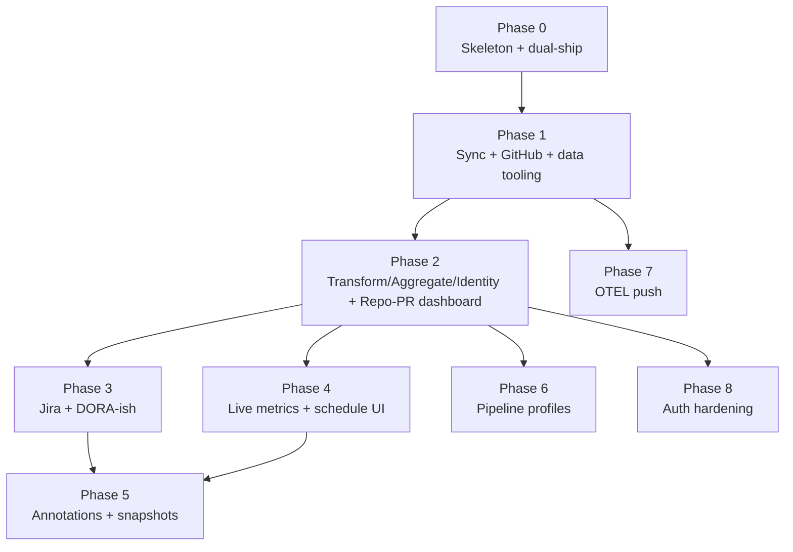

# Factarium — Phased Implementation Plan

> Companion to [`objective.md`](./objective.md). This document turns the vision
> (`sync → transform → aggregate → render`) into a sequence of milestones with
> concrete scope, exit criteria, and deliberately deferred work.

## 1. Locked decisions

These were confirmed during planning and constrain everything below.

| Area | Decision |
|---|---|
| **Primary data sources** | GitHub + Jira via **pull/API polling**. Claude Code **OTEL (push/OTLP)** is a later phase, but the sync abstraction is designed for it now. |
| **First dashboards** | (1) Repo/PR activity overview, (2) DORA-ish delivery metrics. |
| **DORA deploy signal (v1)** | **PR-merge-to-a-configured-branch** (e.g. `main`) used as the deployment proxy. Real deployment/incident sources deferred. |
| **Local-dev data preservation** | Both **pg_dump snapshot/restore** *and* a first-class **fake/seed data generator**. Fake data is a hard requirement, not an afterthought. |
| **Identity / auth** | **Local single-user**, with a `CurrentUser` abstraction + role/permission seams so OIDC/JWT drops in later without refactoring. |
| **Ship targets** | **Both** `docker compose up` dev-mode *and* a **self-contained single-exe** (that can provision Postgres-in-Docker) kept green from Phase 0 onward. |
| **Charting** | **vue-echarts** (Apache ECharts). |
| **Worker engine (v1)** | **Simple Quartz-scheduled** transforms with staleness/freshness gating + schedule-management UI + manual "run now". Priority/weighting/concurrency and swappable **pipeline profiles** deferred to a dedicated phase. |
| **Person ↔ Identity mapping** | Sync creates unmapped **Identity** records; a **manual mapping UI** links them to first-class **Person** records; a **re-attribution transform** rewrites historical attribution. |
| **Annotations + snapshots** | Deferred to a later, dedicated phase (nice-to-have, but immutable-snapshot semantics are pre-considered in the data model). |
| **Stack** | .NET 10, EF Core, Quartz.NET, PostgreSQL; Vue 3 + Vuetify 4 + vue-echarts. |

---

## 2. Architecture overview

### 2.1 The four-stage model as data tiers

Factarium is Postgres-only by default. We lean on a medallion-style layering so
transforms are cheap to re-run and easy to reason about.

```mermaid
flowchart LR
  subgraph Sources
    GH[GitHub API]
    JIRA[Jira API]
    OTEL[Claude Code OTLP\n(later)]
  end

  GH -->|pull| RAW
  JIRA -->|pull| RAW
  OTEL -.->|push| RAW

  subgraph DB[Single PostgreSQL instance]
    RAW[(Raw facts\n'bronze'\nappend-only replicated records)]
    CANON[(Canonical\n'silver'\nnormalized + person-attributed)]
    METRICS[(Materialized metrics\n'gold'\ntimeseries, aggregates)]
    SNAP[(Snapshots + annotations\nlater)]
  end

  RAW -->|transform| CANON
  CANON -->|aggregate| METRICS
  CANON -->|transform-of-transform| CANON
  METRICS --> RENDER
  METRICS -.-> SNAP

  subgraph Render
    RENDER[Vue + Vuetify + vue-echarts\ndashboards]
  end
```

- **Sync** → writes to **Raw** (bronze). Raw records are immutable replicas of
  the source payload + provenance (source, entity id, fetched-at, cursor).
- **Transform** → Raw becomes **Canonical** (silver): normalized entities
  (PullRequest, Commit, Review, Issue, SprintTransition…) with `PersonId`
  attribution resolved via the identity map.
- **Aggregate** → Canonical becomes **Materialized metrics** (gold): timeseries
  and rollups sized for dashboard queries. Staleness rules decide when to recompute.
- **Render** → dashboards query gold tables only (fast, predictable).

### 2.2 Component/solution layout

```
factarium/
├─ src/
│  ├─ Factarium.Domain/            # entities, value objects, no infra deps
│  ├─ Factarium.Application/       # use-cases, pipeline contracts, CurrentUser
│  ├─ Factarium.Infrastructure/    # EF Core, Postgres, Quartz jobs, secrets
│  ├─ Factarium.Integrations/      # source connectors (GitHub, Jira, OTEL…)
│  │  ├─ Abstractions/             # ISyncSource, IPullSource, IPushSource
│  │  ├─ GitHub/
│  │  └─ Jira/
│  ├─ Factarium.Api/               # ASP.NET Core host: REST, serves SPA, OTLP receiver (later)
│  └─ Factarium.Cli/               # single-exe entrypoint, `db`, `sync`, `snapshot`, `seed`
├─ web/                            # Vue 3 + Vuetify 4 + vue-echarts SPA
├─ deploy/
│  ├─ docker-compose.yml           # api + web + postgres (dev-mode)
│  └─ single-exe/                  # publish profile, Postgres-in-Docker bootstrap
├─ snapshots/                      # pg_dump artifacts (gitignored, restorable)
├─ seed/                           # fake-data generator profiles/fixtures
└─ docs/
```

> The `Api` host serves the built SPA in single-exe mode and proxies in dev-mode,
> so **both ship targets exercise the same code**.

### 2.3 Sync abstraction (built to fit pull *and* push now)

```
ISyncSource            // common: identity/provenance, raw-write contract
├─ IPullSource         // scheduled, cursor/watermark, rate-limit aware  → GitHub, Jira
└─ IPushSource         // receives inbound events, validates, writes raw  → OTEL (later)
```

Designing both interfaces in Phase 1 (even though only pull is implemented) is
what keeps the OTEL milestone from becoming a refactor.

---

## 3. Cross-cutting concerns (apply to every phase)

- **Both ship targets stay green.** Every phase's exit criteria include "works in
  `docker compose up` **and** as the published single-exe."
- **Migrations.** EF Core migrations are the single source of truth; `Cli db migrate`
  runs them on startup in single-exe mode.
- **Config & secrets.** Integration credentials (GitHub token, Jira token) stored
  encrypted at rest; local-dev uses a simple key. Never commit real tokens.
- **Auth seam.** All request handling flows through `ICurrentUserAccessor`. Local
  mode returns a single seeded user; endpoints carry `[Authorize]`-ready policy
  attributes that are no-ops locally.
- **Testing.** Domain/transform logic unit-tested; integration tests run against a
  throwaway Postgres (Testcontainers); connector tests use recorded fixtures.
- **PII discipline.** Synced data may contain real names/emails/usernames — treat
  the store as sensitive, keep it local, and use the fake-data generator for any
  shared/demo artifacts.
- **Observability.** Structured logging + a `/health` and sync/worker status surface
  from Phase 0.

---

## 4. Phases & milestones

Each phase is an independently demoable increment.

### Phase 0 — Walking skeleton & dual-ship foundation
**Goal:** Empty-but-real app that runs both ways and migrates a DB.

- Solution + project scaffolding per §2.2; .NET 10, nullable + analyzers on.
- Postgres via `deploy/docker-compose.yml`; EF Core wired with an initial migration.
- Single-exe publish profile; CLI bootstraps Postgres-in-Docker if none configured.
- Vue 3 + Vuetify 4 + vue-echarts scaffold; dev proxy + built-SPA-serving in host.
- `ICurrentUserAccessor` with seeded local user; policy attributes present (no-op).
- `/health`, structured logging, CI (build, test, publish both targets).

**Milestone / exit:** `docker compose up` and the single-exe both serve an empty
dashboard, migrate the DB, and report health. CI publishes both artifacts.

**Deferred:** any real data.

---

### Phase 1 — Sync foundation + GitHub + data lifecycle tooling
**Goal:** Real GitHub facts land in Raw, resumably, and dev data is reproducible.

- `ISyncSource`/`IPullSource`/`IPushSource` abstractions (only pull implemented).
- Raw fact storage: append-only, provenance columns, per-source cursors/watermarks.
- Integration registration + encrypted credential storage; connection-test endpoint.
- **GitHub connector (pull):** repos, commits, pull requests, reviews; incremental
  sync via cursors; GitHub rate-limit/backoff handling.
- **Quartz.NET** scheduling for sync jobs + a **manual "run this integration now"**
  trigger; a minimal schedule-status view (foundation for the mgmt UI).
- **`snapshot` / `restore` CLI** wrapping `pg_dump`/`pg_restore` into `snapshots/`.
- **Fake-data generator** (`seed`): deterministic, profile-driven GitHub-shaped raw
  data so the full pipeline can be exercised with zero API calls.

**Milestone / exit:** Point at a real GitHub org → data replicates into Raw and
resumes cleanly; `snapshot`→wipe→`restore` round-trips; `seed` populates a fresh DB
with believable fake data.

**Deferred:** transforms, dashboards, Jira, OTEL.

---

### Phase 2 — Transform + Aggregate + Identity + first render
**Goal:** The complete `sync → transform → aggregate → render` loop, demoable on GitHub.

- **Canonical model:** normalize Raw GitHub into PullRequest/Commit/Review entities.
- **Person + Identity model:** sync creates unmapped Identity rows; **manual mapping
  UI** links Identity→Person; **re-attribution transform** rewrites `PersonId` on
  canonical rows (handles "one person, many GitHub logins").
- **Worker model (simple):** Quartz-scheduled transform/aggregate jobs with
  **staleness/freshness gating** ("don't recompute if newer than X").
- **Materialized metrics:** timeseries + rollups for repo/PR activity.
- **Render — Repo/PR Activity dashboard** (vue-echarts): commits over time, PRs
  opened/merged, review latency, activity by Person.

**Milestone / exit:** From a fresh DB (fake or real), one command chain produces a
live Repo/PR Activity dashboard with correct per-Person attribution after mapping.

**Deferred:** Jira, DORA, live metrics, pipeline profiles.

---

### Phase 3 — Jira source + DORA-ish delivery dashboard
**Goal:** Prove multi-source + cross-source identity; ship the second dashboard.

- **Jira connector (pull):** issues, sprints, status transitions, assignees.
- Canonical Jira entities; **cross-source identity mapping** (Jira account +
  GitHub login → same Person).
- **DORA-ish metrics:** PR lead time, cycle time, review latency, throughput, and
  **deployment frequency via PR-merge-to-configured-branch proxy**. Clearly label
  the proxy so it's honest about what it measures.
- **Render — DORA-ish Delivery dashboard** (vue-echarts).

**Milestone / exit:** Two sources synced; DORA-ish dashboard renders from merged
GitHub+Jira canonical data with unified Person attribution.

**Deferred:** true deployment/incident sources (change-failure rate, MTTR).

---

### Phase 4 — Live metrics + schedule/pipeline management UI
**Goal:** Satisfy the "live metrics" tenant and the "view/manage schedules" requirement.

- **Live/transient dashboards:** current-state widgets (e.g. sprint completion %)
  computed on-read or on short intervals rather than from gold rollups.
- **Schedule & pipeline management UI:** list/enable/disable/trigger Quartz jobs,
  see last-run/next-run/last-error, per-source freshness.

**Milestone / exit:** A user can watch a live current-sprint widget and fully manage
sync/transform schedules from the UI.

**Deferred:** advanced pipeline profiles.

---

### Phase 5 — Annotations + immutable metric snapshots
**Goal:** The "keep a copy of what you were looking at" feature.

- **Annotations** attached to metrics/dashboards/time-ranges.
- **Immutable snapshots:** capture the *data* behind a view (not just a link) so an
  annotation retains context even after underlying data is recomputed/cleaned.

**Milestone / exit:** Annotate a dashboard; later recompute/wipe metrics; the
annotation still shows the original snapshotted data.

---

### Phase 6 — Advanced pipeline engine (profiles, priority, weighting, concurrency)
**Goal:** The full worker model from the objective.

- Per-transform **priority, weighting, concurrency limits**.
- **Swappable pipeline profiles** ("GitHub-only now", "heavy-workloads while idle").
- **Transform-of-transform** chaining with dependency ordering.

**Milestone / exit:** Swap profiles at runtime and observe scheduling/concurrency
change accordingly, with chained transforms respecting dependencies.

---

### Phase 7 — Claude Code OTEL ingestion (push/OTLP)
**Goal:** Add the first push source using the seams built in Phase 1.

- **OTLP receiver** endpoint in the Api host; validate + write to Raw via `IPushSource`.
- Claude Code telemetry canonical schema + transforms + relevant metrics/dashboard.

**Milestone / exit:** Claude Code OTEL data ingests via push and flows through the
same transform→aggregate→render pipeline.

---

### Phase 8 — Auth hardening & distribution polish (when needed)
**Goal:** Turn the auth seams into real multi-user/AuthN-AuthZ; harden packaging.

- OIDC/OAuth provider + JWT; policy-based authorization activated.
- Multi-user Person↔account linkage; local mode still frictionless.
- Single-exe distribution hardening (installers, upgrade/migration UX).

**Milestone / exit:** Same app runs frictionless locally *and* supports real
multi-user auth without a rewrite.

---

## 5. Dependency flow



Phases 4, 6, 7, 8 can move relative to each other; the **critical path to a
demoable product is 0 → 1 → 2 → 3**.

## 6. Open questions to revisit later

- True DORA change-failure-rate / MTTR needs an incident source — which one?
- OTEL: which Claude Code telemetry signals are actually worth materializing?
- Retention policy for Raw facts (the objective wants "as long as you need it" —
  make it configurable per source).
- Multi-user auth provider choice (Phase 8) once a real deployment target exists.
